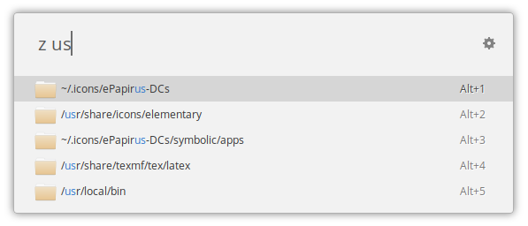

# z Search

[](https://ext.ulauncher.io/-/github-brpaz-ulauncher-file-search)



An extension for [Ulauncher](https://ulauncher.io) to **quickly** search for directories using the `.z` file usually created and maintained by [`z`](https://github.com/rupa/z). The search results are ordered by *frecency*, a portmanteau of *recent* and *frequency* - a directory you visited often or recently is ranked high. When you open a directory via this extension (or via `cd` or [`z`](https://github.com/rupa/z)), the ranking is updated.

### Highlights
- Fast... really fast
- *Frecency* based
- Updates ranking the same way `cd` and `z` do

 Steps to install `z` can be found in the header of the [`z.sh` script](https://github.com/rupa/z/blob/master/z.sh).

### Stand-alone Use
In principle, you do not need to have [`z`](https://github.com/rupa/z) installed if you create and fill the `.z` file yourself. However, installing it is highly recommended as that makes the terminal `cd` command add entries to the `.z` file, so you don't have to add directories by hand. If you only want to be able to quickly open specific directories, the no [`z`](https://github.com/rupa/z) route is viable. Just add the following line to your `.z` file for each directory you want to be accessible by the extension.
```
<path-to-directory>|1|1
```

